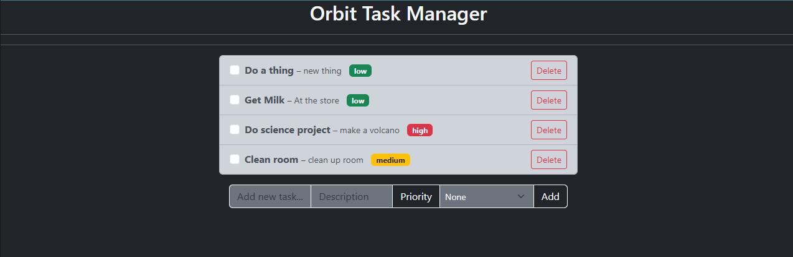
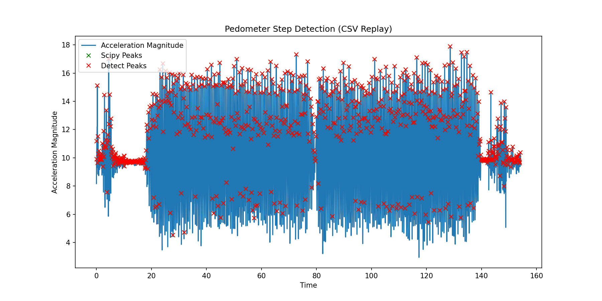
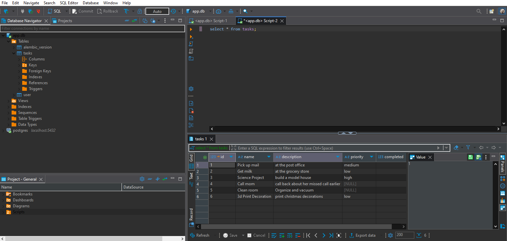

# Professional Self-Assessment

### Career and Skills Assessment

I came into the Computer Science program at SNHU already working in a role in the software development field, as a Site Reliability Engineer. My original career started in hardware and networking at a large data center, and I have pivoted to working as a network engineer and linux systems administrator before moving to a site reliability engineering role where I have a much larger need to develop software for automation. After reaching the senior level in engineering I began to consider specializing in one of a few different fields, but many of them are heavy in math and require a large amount of academic computer science knowledge that I had not built up. I took my existing coding skills and began my degree in software engineering at SNHU, and I am now finishing up my last classes and performing the end of program capstone projects. 
During the program I was able to greatly add to and augment my existing knowledge and skills with classes that helped me understand the theoretical underpinnings of the hardware and software that I have worked with in my career so far. From fundamental math, including discrete math and linear algebra to bridging the gap in theory and practice with courses like operating systems I believe I have become a much more well rounded engineer and I feel confident in moving onto deeper technical roles and possibly graduate studies in the future.

Professionally I greatly value producing correct software that is well tested and secure. I think it is a disservice to users of software I write to not put the utmost care into the foundational parts of that software that the user experiences, and even worse to betray their trust by not learning and implementing the industry's cutting edge practices and processes for securing that software. Classes like CS305: Software Security along with CS320: Software Testing, Automation, and Quality Assurance were instrumental in developing skills related to not only implementing correct and secure software, but helping to demonstrate that correctness every time the software is deployed through modern DevOps practices like continuous integration, automated testing, and using static and dynamic analysis of software with different security tools to stop critical vulnerabilities before the software ever enters production. As a platform engineer in my newest position I use these techniques daily to automate testing and security procedures, along with providing automated tools for other developers to use that have these best practices built in.

Developing this ePortfolio has allowed me to show different strengths that I have developed or built on throughout my program at SNHU, including a diverse set of skills on all parts of the SDLC as well as the human and communication components needed to work with others outside the engineering process in order to make the software built in that SDLC serve a greater need whether that be stakeholders and customers in a business, or open source users who might use a project I’ve developed on my own time.
Collaborating in a team environment is an extremely important skill, and as someone who has done remote work for approximately the last seven years, being able to do this over asynchronous communication systems like Slack or email is extremely important. I was able to help develop this skill during the program specifically through items like weekly communication and collaboration with other students in discussion posts, or during classes that foster discussion as a coding community where we are encouraged to work together when we have issues.

Communicating with stakeholders is also a common occurrence in the working world and a skill that is absolutely required to operate well throughout your career as a software engineer. While most of the projects in my program generally only have one direct stakeholder, the professor teaching that class, I often found that I needed to communicate with them to clarify exactly what was necessary for a project when the requirements were vague. This process involves communicating efficiently and concisely in a manner that did not require a ton of back and forth time as the deadlines for many projects were short and communication between professors and students is asynchronous through email. I believe that this has helped me refine my process in the business world as well, as I will try to concisely explain context to stakeholders on projects without miring them down in useless details, formulating exactly the questions I need answered in order to keep the conversation on topic and drive the project forward, just the way I needed to with my professors in my courses.

I have also developed more technical specific skills, and one of the reasons I started the program in CS at SNHU was to develop more of the academic side of CS, which is heavily focused on math, and both algorithms and data structures. CS300:Data Structures and Algorithms laid the groundwork for that understanding, which was later implemented directly in many different projects during my upper level classes, including the capstone presented in this ePortfolio. In addition to this class I spend a lot of personal time working on algorithm problems from sites like LeetCode, which has informed a lot of the way I work on building applications that perform well, by building experience choosing the correct data structure or algorithm to fit the type of problem I’m working on.

Taking classes like CS465: Full Stack development, allowed me to take skills built up in the rest of my coursework and focus it on an area that I would like to expand my career in, improving in both software engineering design and databases. As a current platform engineer and former SRE, I work with many different applications and focus on their reliability and performance, however I often didn’t have the full picture for things that I had no direct experience with, mainly frontends, and things like mobile applications that called the API’s I usually worked on. Classes like CS360: Mobile Development gave me an introduction, and further personal projects and coursework such as the enhancements in this capstone have allowed me to develop a much better understanding of parts of the stack I was not familiar with before and had a hard time developing in my job due to limited time and need to focus on critical areas I already had experience with. Working with different databases like MongoDB and PostgresQL or other SQL and NoSQL variants has exposed me to a wide range of options for applying specific problems to data models.

Lastly, security has always been integral in my current work, and through courses previously mentioned like CS305: Software Security, along with the topics covered in classes like CS465: Full Stack Development that relate to security I have added many new techniques to my toolkit. Automated scanning with SAST and DAST tools is something I include in all of my projects and I have even evaluated these tools for the company I work at in the SaaS realm, along with open source tools for code at all levels of the stack including infrastructure as code for components running on Amazon Web Services. I think security is extremely important as one of the major values I hold as a software engineer is that the user's trust is sacred and I should be doing everything possible to protect anyone who uses the software I write in any way that I can.

### ePortfolio Artifacts Summary

For this ePortfolio I wanted to focus on two specific areas that relate to what I wanted to improve as well as move forward with in my career in the future. These were full stack development, and algorithms and data structures. As I was required to cover 3 distinct enhancement categories including Software Engineering and Design, Algorithms and Data Structures, and Databases, I decided to split the categories along two separate projects, where one would be focused specifically on algorithms, and the other would encompass a full stack application that covered software engineering and design, along with the database requirement.

The initial artifact used to for the full stack project was a piece of code written for the class CS320: Software Testing, Automation, and Quality Assurance, and contained a abstract class for a Task object that would be used in a task management system, as well as a service layer TaskService object, and automated testing with validation for many different inputs to both of these classes. This initial code served as the base for a full stack task management application I have developed called Orbit, which involved porting the initial Java code to Python in order to use a web framework I was already familiar with, Flask, as well as development of an underlying data model and implementation of a SQL database for the application that uses SQLite for local development and a docker based PostgresQL container for a ‘real’ database deployment.

For the algorithms and data structures component, the initial code was an Android application that reads accelerometer data from the device and simply displays the x, y, and z values from that sensor. I planned to use this as a base to implement a more advanced algorithm, specifically a pedometer that measures step data from accelerometer inputs, and add advanced components to the algorithm detection including magnitude based detection to avoid directional skew (phone upside down for instance), along with a modifiable threshold to cut noise from data after visual inspection, as well as a configurable distance filter to help remove noise from movement unrelated to steps. In addition I ended up developing a small Python toolkit to easily visualize the test data with the same algorithm allowing for rapid prototyping of changes to the algorithm, by marking found ‘step’ points on a graph of the data. The test data was sourced from a creative commons repository of walking data from smart devices on Kaggle.

---

# Code Review

Below is a sample code review for the artifacts used to create my capstone projects:

  <iframe src="https://www.youtube.com/embed/v-1T29V9PY4?si=H-fPtHUCO87dQzMn"
          title="Test Code Review"
          frameborder="0"
          allow="accelerometer; autoplay; clipboard-write; encrypted-media; gyroscope; picture-in-picture"
          allowfullscreen
          style="position: absolute; top: 0; left: 0; width: 100%; height: 100%;">
  </iframe>

---

# Project 1: Software Engineering and Design

Lorem ipsum dolor sit amet, consectetur adipiscing elit. Sed euismod, urna eu tincidunt consectetur, nisi nisl aliquet nunc, vel convallis magna justo nec erat. Curabitur vel fermentum elit, et efficitur felis. Integer sed pulvinar augue. Suspendisse potenti. Duis non orci sit amet elit tempor hendrerit a sed enim.

---

# Project 2: Algorithms and Data Structures

Lorem ipsum dolor sit amet, consectetur adipiscing elit. Sed euismod, urna eu tincidunt consectetur, nisi nisl aliquet nunc, vel convallis magna justo nec erat. Curabitur vel fermentum elit, et efficitur felis. Integer sed pulvinar augue. Suspendisse potenti. Duis non orci sit amet elit tempor hendrerit a sed enim.

---

# Project 3: Databases

Lorem ipsum dolor sit amet, consectetur adipiscing elit. Sed euismod, urna eu tincidunt consectetur, nisi nisl aliquet nunc, vel convallis magna justo nec erat. Curabitur vel fermentum elit, et efficitur felis. Integer sed pulvinar augue. Suspendisse potenti. Duis non orci sit amet elit tempor hendrerit a sed enim.

